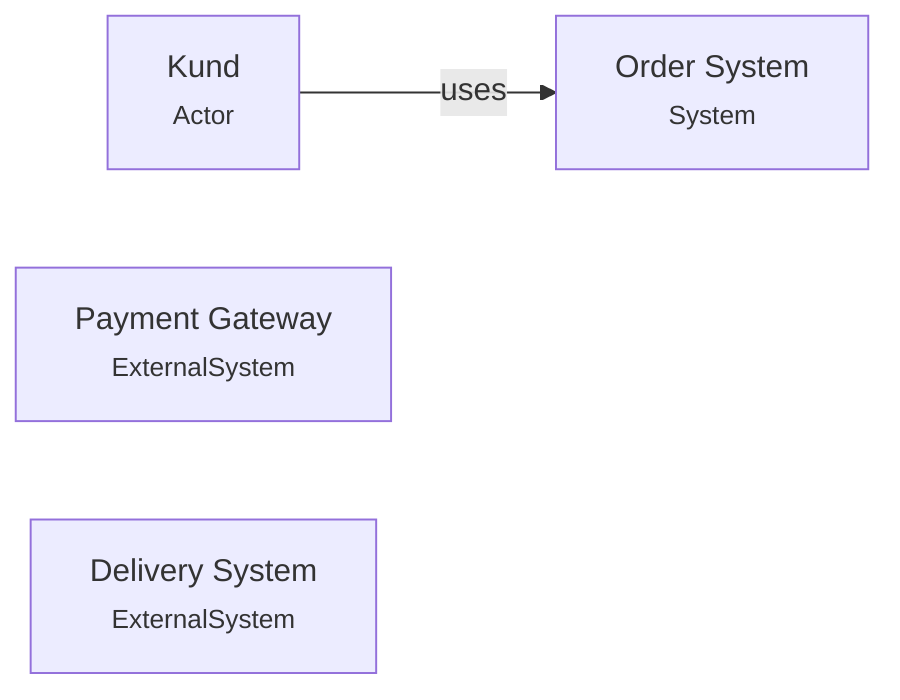
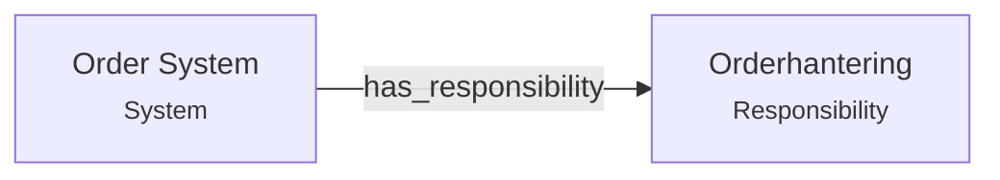
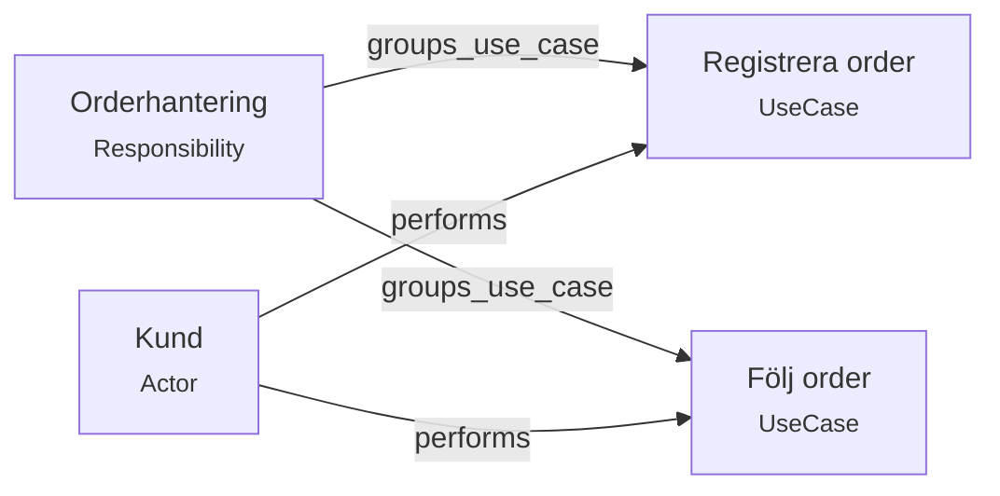
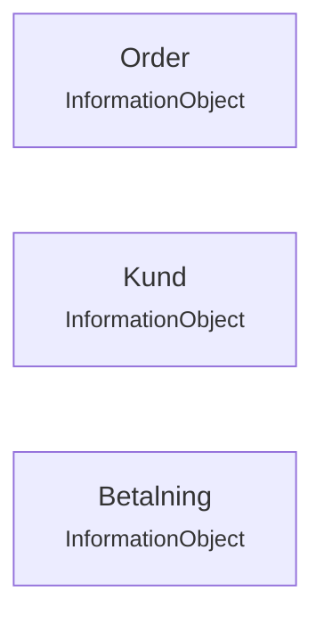
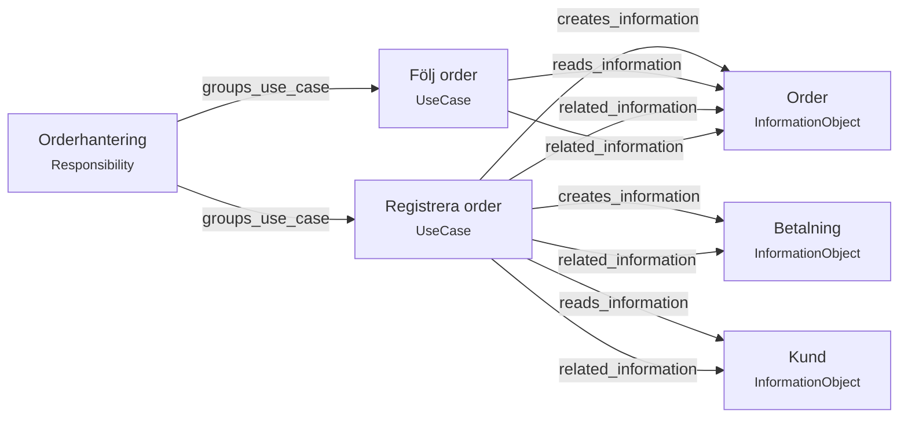
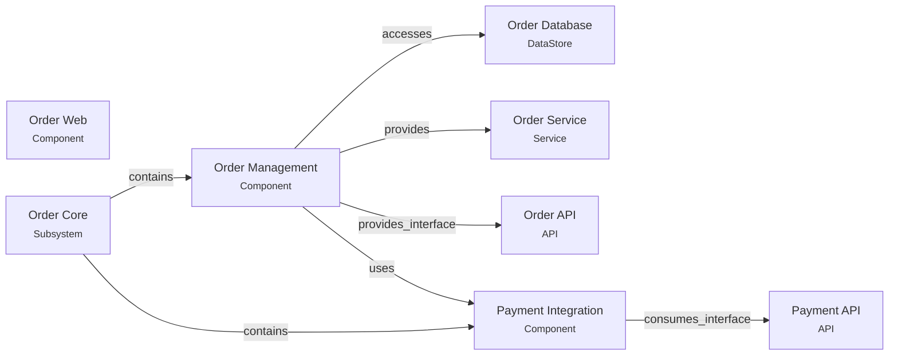
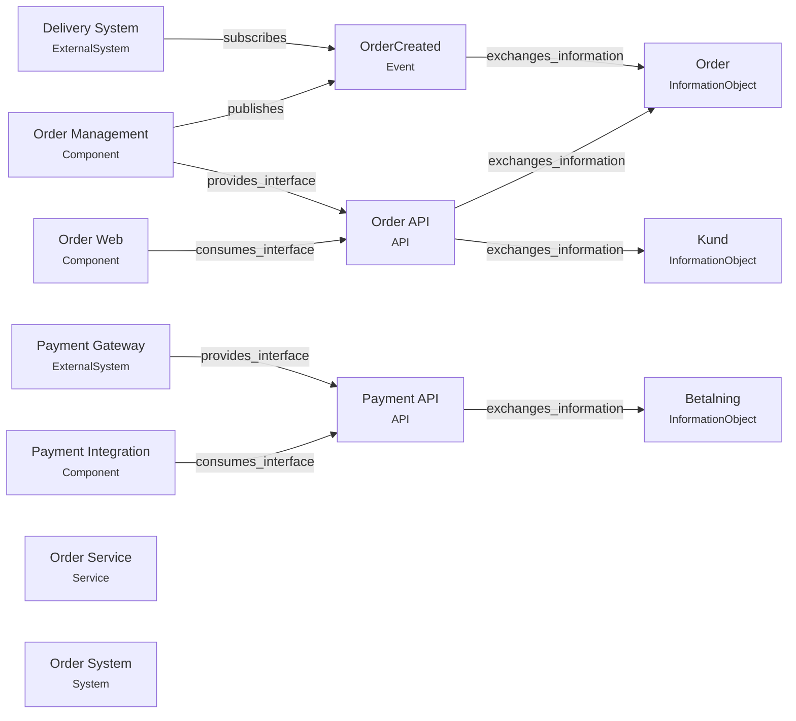
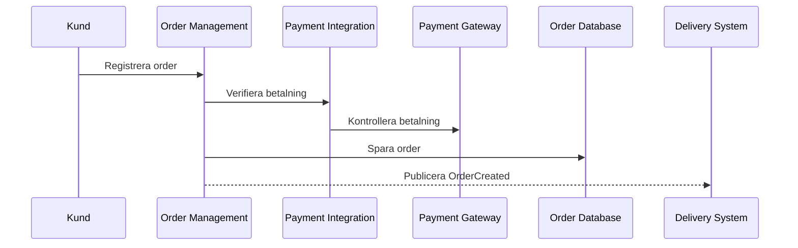
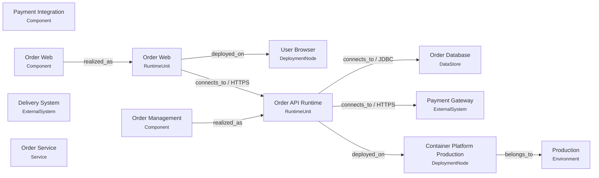

# Arkitekturbeskrivning – Reference Order System

> Genererad från System Modellers kanoniska YAML-modell. Diagram och sammanställningar är härledda vyer och utgör inte separat sanningskälla.

## 1. Syfte och omfattning

Hanterar kundorder från registrering till publicerad orderhändelse.

| System | Beskrivning |
| --- | --- |
| Order System | Hanterar kundorder från registrering till publicerad orderhändelse. |

## 2. Systemets sammanhang

Modellen innehåller **1 aktör(er)** och **2 externt system/systemtjänst(er)** i systemkontexten.

| Typ | Namn | Beskrivning |
| --- | --- | --- |
| Aktör | Kund | Registrerar och följer sina order. |
| Externt system | Delivery System | Externt system som tar emot skapade order för leverans. |
| Externt system | Payment Gateway | Extern tjänst som verifierar betalning. |

## 3. Funktionell översikt

Systemets modellerade funktionella ansvar sammanfattas nedan.

| Ansvar | Beskrivning |
| --- | --- |
| Orderhantering | Ansvarar för att registrera, lagra och följa order. |

## 4. Aktörer och use cases

| Use case | Primär aktör | Ansvar | Utfall |
| --- | --- | --- | --- |
| Följ order | Kund | Orderhantering | Kunden ser aktuell orderstatus. |
| Registrera order | Kund | Orderhantering | En order är registrerad och redo för fortsatt hantering. |

## 5. Informationsarkitektur

| Informationsobjekt | Beskrivning | Ägare | Klassificering |
| --- | --- | --- | --- |
| Betalning | Information om verifieringen av betalningen. |  |  |
| Kund | Information som identifierar kunden som gör beställningen. |  |  |
| Order | Kundens beställning och dess aktuella status. |  |  |

### Funktion och information

## 6. Logisk arkitektur

| Typ | Namn | Ansvar/beskrivning |
| --- | --- | --- |
| Subsystem | Order Core | Logisk kärna för orderhantering. |
| Component | Order Management | Hanterar orderns livscykel och status. |
| Component | Order Web | Webbgränssnitt för kundens orderflöden. |
| Component | Payment Integration | Isolerar kommunikationen med extern betalningstjänst. |
| Service | Order Service | Erbjuder logiska orderoperationer. |
| DataStore | Order Database | Logiskt datalager för orderinformation. |

## 7. Integrationsarkitektur

| Typ | Namn | Producent/provider | Konsumenter | Protokoll/läge |
| --- | --- | --- | --- | --- |
| API | Order API | Order Management | Order Web | HTTPS |
| API | Payment API | Payment Gateway | Payment Integration | HTTPS |
| Event | OrderCreated | Order Management | Delivery System | asynchronous |

## 8. Viktiga scenarier

| Scenario | Use case | Utfall |
| --- | --- | --- |
| Kund registrerar order | Registrera order | Ordern är lagrad, betalningen verifierad och OrderCreated publicerad. |

## 9. Runtime och deployment

| Typ | Namn | Slag | Teknik/plattform |
| --- | --- | --- | --- |
| Environment | Production | production |  |
| DeploymentNode | Container Platform Production | container_platform | Container platform |
| DeploymentNode | User Browser | client_device |  |
| RuntimeUnit | Order API Runtime | application_service |  |
| RuntimeUnit | Order Web | web_application |  |

## 10. Arkitekturbeslut och constraints

| Typ | Namn | Beslut/regel | Motiv |
| --- | --- | --- | --- |
| Beslut | Isolera betalningsintegration | Kommunikation med Payment Gateway kapslas bakom Payment Integration. | Minskar koppling mellan orderlogik och extern leverantör. |
| Constraint | TLS för extern trafik | All extern trafik ska använda TLS. | Skydda information under överföring. |

## 11. Kända osäkerheter

Följande delar bör verifieras eller kompletteras med evidens. Att något listas här betyder inte automatiskt att det är fel.

| ID | Typ | Namn/relation | Orsak |
| --- | --- | --- | --- |
| NODE-000001 | DeploymentNode | User Browser | infererad |
| RSP-000001 | Responsibility | Orderhantering | infererad |
| INFO-000001 | InformationObject | Order | infererad |
| SUB-000001 | Subsystem | Order Core | infererad |
| CMP-000001 | Component | Order Management | infererad |
| CMP-000002 | Component | Payment Integration | infererad |
| CMP-000003 | Component | Order Web | infererad |
| SVC-000001 | Service | Order Service | infererad |
| UC-000001 | UseCase | Registrera order | infererad |
| UC-000002 | UseCase | Följ order | infererad |
| SCN-000001 | Scenario | Kund registrerar order | infererad |
| INT-000001 | Interaction | Registrera order | infererad |
| EVD-000001 | Evidence |  | saknar evidensreferens |
| EVD-000002 | Evidence |  | saknar evidensreferens |
| EVD-000003 | Evidence |  | saknar evidensreferens |
| EVD-000004 | Evidence |  | saknar evidensreferens |
| EVD-000005 | Evidence |  | saknar evidensreferens |
| OBS-000001 | Observation |  | saknar evidensreferens |
| REF-000001 | SourceReference |  | saknar evidensreferens |
| REF-000002 | SourceReference |  | saknar evidensreferens |
| REF-000003 | SourceReference |  | saknar evidensreferens |
| REF-000004 | SourceReference |  | saknar evidensreferens |
| REF-000005 | SourceReference |  | saknar evidensreferens |
| SRC-000001 | Source | README.md | saknar evidensreferens |
| SRC-000002 | Source | Order Java sources | saknar evidensreferens |
| SRC-000003 | Source | schema.sql | saknar evidensreferens |
| SRC-000004 | Source | openapi.yaml | saknar evidensreferens |
| SRC-000005 | Source | docker-compose.yaml | saknar evidensreferens |
| REL-000001 | Relationship | uses | saknar evidensreferens |
| REL-000021 | Relationship | stores_information | saknar evidensreferens |
| REL-000022 | Relationship | accesses | saknar evidensreferens |
| REL-000030 | Relationship | affects | saknar evidensreferens |
| REL-000031 | Relationship | affects | saknar evidensreferens |
| REL-000034 | Relationship | realized_as | infererad |
| REL-000023 | Relationship | realized_as | infererad |
| REL-000024 | Relationship | deployed_on | infererad |
| REL-000025 | Relationship | deployed_on | saknar evidensreferens |
| REL-000026 | Relationship | belongs_to | saknar evidensreferens |
| REL-000027 | Relationship | connects_to | saknar evidensreferens |
| REL-000028 | Relationship | connects_to | saknar evidensreferens |
| REL-000029 | Relationship | connects_to | saknar evidensreferens |
| REL-000002 | Relationship | has_responsibility | saknar evidensreferens |
| REL-000007 | Relationship | creates_information | saknar evidensreferens |
| REL-000008 | Relationship | reads_information | saknar evidensreferens |
| REL-000009 | Relationship | creates_information | saknar evidensreferens |
| REL-000010 | Relationship | reads_information | saknar evidensreferens |
| REL-000017 | Relationship | provides_interface | saknar evidensreferens |
| REL-000018 | Relationship | consumes_interface | saknar evidensreferens |
| REL-000019 | Relationship | publishes | saknar evidensreferens |
| REL-000020 | Relationship | subscribes | saknar evidensreferens |
| REL-000011 | Relationship | contains | infererad |
| REL-000012 | Relationship | contains | infererad |
| REL-000013 | Relationship | provides | infererad |
| REL-000014 | Relationship | realized_by | infererad |
| REL-000015 | Relationship | uses | infererad |
| REL-000016 | Relationship | owns_information | saknar evidensreferens |
| REL-000035 | Relationship | realized_by | infererad |
| REL-000003 | Relationship | performs | saknar evidensreferens |
| REL-000004 | Relationship | performs | saknar evidensreferens |
| REL-000005 | Relationship | groups_use_case | saknar evidensreferens |
| REL-000006 | Relationship | groups_use_case | saknar evidensreferens |
| REL-000032 | Relationship | scenario_for | saknar evidensreferens |
| REL-000033 | Relationship | realizes_scenario | infererad |

## 12. Källor och evidens

Modellen innehåller **5 källa/källor**, **5 källreferens(er)** och **5 evidenspost(er)**.

| ID | Källa | Typ | Plats |
| --- | --- | --- | --- |
| SRC-000002 | Order Java sources | source_code | ../input/src/main/java/example/order |
| SRC-000001 | README.md | documentation | ../input/README.md |
| SRC-000005 | docker-compose.yaml | configuration | ../input/deploy/docker-compose.yaml |
| SRC-000004 | openapi.yaml | api_specification | ../input/openapi.yaml |
| SRC-000003 | schema.sql | database_schema | ../input/db/schema.sql |

---

_Genererad av System Modeller 0.1.0-dev.30 från 44 modelelement och 35 relationer._
